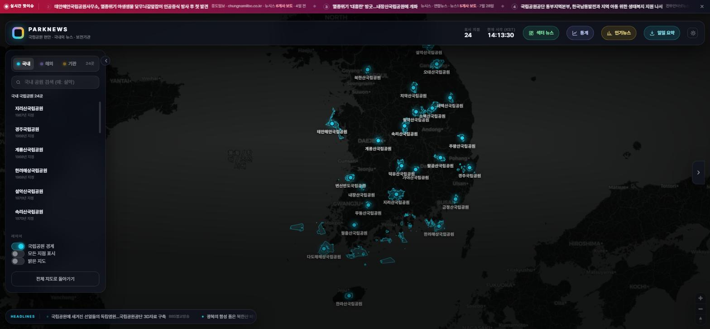
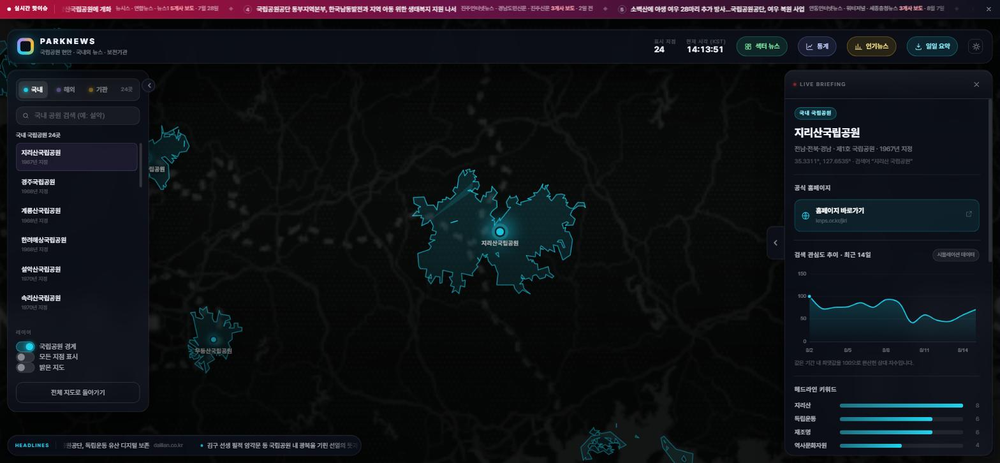

# 🌐 파크뉴스 (PARKNEWS)

### 국립공원 관련 뉴스를 지도 위에서 한눈에 보는 사이트입니다.

**설치할 것도, 로그인할 것도 없습니다. 아래 주소를 누르면 바로 열립니다.**

# 👉 **[https://parknews.vercel.app](https://parknews.vercel.app)**



## 이게 뭔가요?

전국 **국립공원 24곳**과 **해외 국립공원 3,313곳**에 대한
뉴스·통계·순위를 지도 위에 올려놓은 웹사이트입니다.

- 지도에서 **공원을 누르면** 그 공원 관련 최신 기사가 바로 뜹니다
- 요즘 **어떤 사안이 화제인지** 순위로 보여줍니다
- 그 순위를 **실시간 · 일간 · 주간 · 월간 · 연간**으로 나눠 볼 수 있습니다

휴대폰에서도 그대로 열립니다. 화면이 좁아지면 목록과 상세가 아래에서 올라오는 형태로 자동 전환됩니다.

---

## 어디로 들어가나요?

| 원하는 것 | 주소 |
|---|---|
| 🗺️ **지도에서 공원별 뉴스 보기** | **<https://parknews.vercel.app>** |
| 🧭 **분야별(행정·재난안전·자원보전·탐방시설) 뉴스 보기** | **<https://parknews.vercel.app/dashboard>** |
| 🏆 **기간별 인기뉴스 순위 보기** | 위 지도 화면 상단의 **[인기뉴스]** 버튼 |

> 💡 즐겨찾기에 추가해두고 쓰시면 편합니다.
> 사내망 GitLab에서도 같은 사이트를 볼 수 있게 준비 중입니다 (아래 *담당자용* 참고).

---

## 화면 둘러보기

### 1. 지도 대시보드 — 공원별 뉴스

처음 열면 대한민국 지도에 **국립공원 24곳**이 표시됩니다.

| 이렇게 하면 | 이렇게 됩니다 |
|---|---|
| 공원 이름이나 영역을 **클릭** | 옆에 그 공원의 최신 기사·통계가 열립니다 |
| 위쪽 **[해외] 탭** 클릭 | 전 세계 국립공원 3,313곳으로 전환됩니다 |
| 검색창에 **한글로** 입력 | `요세미티`, `옐로스톤`처럼 한글로 해외 공원을 찾을 수 있습니다 |
| 오타가 나도 | `설학산` → 설악산 으로 알아서 찾아줍니다 |
| **[보전기관] 탭** | 기후에너지환경부·국립공원공단·해외 공원청·국제기구 24곳 링크 모음 |
| 화면 위 **[밝은 지도]** | 어두운 지도 ↔ 밝은 지도 전환 (인쇄·보고용으로 유용) |



*지리산국립공원을 누른 모습. 공원 경계가 지도에 그려지고, 오른쪽에 공식 홈페이지 · 검색 관심도 추이 · 헤드라인 키워드가 열립니다.*

> 🔗 **공유하기** — 공원을 하나 선택하면 주소창이 바뀝니다.
> 그 주소를 복사해서 보내면 상대방도 **같은 화면**을 바로 보게 됩니다.

### 2. 섹터 대시보드 — 분야별 뉴스

뉴스를 **행정 · 재난안전 · 자원보전 · 탐방시설** 네 분야로 자동 분류해서 보여줍니다.
"이번 주 재난안전 쪽에 뭐가 있었지?"를 확인할 때 쓰면 좋습니다.

### 3. 인기뉴스 — 기간별 보도량 순위

화면 위 **[인기뉴스]** 버튼을 누르면 열립니다. **국내 / 국외**, 그리고 **기간**을 골라서 볼 수 있습니다.

| 기간 | 무엇을 보여주나 |
|---|---|
| **실시간** | 지금 검색되는 기사로 그 자리에서 집계 |
| **일간** | 어제 하루 |
| **주간** | 최근 7일 |
| **월간** | 최근 30일 |
| **연간** | 최근 12개월 |

각 순위 항목에는 **📍 위치 바로가기** 단추가 붙습니다. 누르면 그 공원으로 지도가 이동합니다.
해외 기사는 제목만 봐서는 어느 나라 공원인지 알 수 없어서 넣었습니다 — 단추에 나라 이름도 함께 표시됩니다.

> ⏳ **실시간 말고는 2026년 8월 16일부터 하루씩 쌓입니다.**
> 지난 기록은 소급되지 않아서, 주간은 7일 · 월간은 30일 · 연간은 12개월이 지나야 온전해집니다.
> 그전까지는 화면에 **"n일치만 쌓여 있습니다"**라고 솔직하게 표시됩니다.

---

## 알아두시면 좋은 점

**뉴스는 어디서 오나요?**
구글·빙 뉴스에서 국립공원 관련 기사를 모아옵니다. 공단이 작성한 기사가 아니라 **언론 보도를 모아 보여주는 것**입니다.

**"설악산 맛집" 같은 기사는 안 뜨나요?**
안 뜹니다. 지명만 겹치고 국립공원과 관계없는 기사는 걸러내도록 만들어져 있습니다. 다만 완벽하진 않아서 가끔 섞일 수 있습니다.

**인기뉴스 순위는 어떻게 매기나요?**
같은 사안을 **몇 개 언론사가 보도했는지**로 계산합니다. **조회수가 아닙니다.**
기사 조회수는 언론사가 공개하지 않아서 가져올 방법이 없습니다. 대신 보도량을 쓰는데, 현안 파악이 목적이라면 오히려 이쪽이 맞습니다 — "얼마나 재밌었나"가 아니라 **"언론이 얼마나 중요하게 봤나"**를 재기 때문입니다.

**연간 순위인데 왜 며칠치밖에 없나요?**
이 기능은 2026년 8월 16일부터 하루씩 기록을 쌓기 시작했습니다. 그 이전 보도는 소급해서 만들 수 없습니다. 쌓인 만큼만 집계하고, 부족하면 화면에 그대로 표시합니다.

**검색 관심도 차트는 어디 갔나요?**
예전에는 네이버 키가 없을 때 **그럴듯하게 지어낸 곡선**을 '시뮬레이션 데이터' 배지와 함께 보여줬습니다. 배지가 붙어 있어도 실제 검색량으로 오해될 수 있어 **걷어냈습니다.** 지금은 **네이버 데이터랩 실측값이 있을 때만** 차트가 나타납니다. 화면에 보이는 숫자는 전부 근거가 있는 값입니다.

**해외 공원이 나라마다 개수가 들쭉날쭉해요.**
예전에는 그랬습니다. 2026-08-16에 출처를 **Wikidata**로 바꿔 편차를 크게 줄였습니다. 호주가 916곳으로 유독 많은 건 오류가 아니라, 호주는 주(州)정부가 지정한 국립공원이 실제로 900곳이 넘기 때문입니다.

**뭔가 안 보이거나 이상하면?**
새로고침을 한 번 해보시고, 그래도 안 되면 담당자에게 알려주세요.

---

<details>
<summary><h2>🔧 담당자 · 개발자용 (누르면 펼쳐집니다)</h2></summary>

기술적인 내용입니다. 사이트를 **보기만** 하실 분은 여기부터는 안 보셔도 됩니다.

### 한 줄 요약

빌드 과정이 없는 **정적 사이트**(HTML + CSS + JS)이며, 뉴스 수집·순위 집계만 서버리스 함수(`api/`)로 처리합니다.
npm 런타임 의존성은 **없습니다** (`package.json`에 `dependencies` 없음).

### 로컬에서 실행

```bash
npx serve .            # → http://localhost:3000
python -m http.server  # → http://localhost:8000
```

`index.html`을 더블클릭해도 열리지만, 일부 브라우저가 `file://`에서 외부 요청을 막으므로 서버 방식을 권장합니다.
**API 키가 하나도 없어도 모든 화면이 동작합니다** (MapLibre + CARTO 무료 타일).

### 파일 구조

```
├─ index.html                # 지도 대시보드
├─ dashboard.html            # 섹터별 뉴스 대시보드
├─ assets/
│  ├─ css/style.css          # 글래스모피즘 · 다크/라이트 지도 · 반응형
│  ├─ data/
│  │  ├─ parks-kr.geojson    # 국내 24곳 공식 경계 (0.83MB)
│  │  └─ parks-global.json   # 해외 3,313곳 + 계층 (1.0MB, 지연 로드)
│  └─ js/
│     ├─ config.js           # ★ 토큰 · 색상 · 프록시 설정
│     ├─ app.js              # 지도 · 마커 · 경계 · 클러스터 · 사이드바 · 딥링크
│     ├─ explorer.js         # ★ 드릴다운 탐색기 + 한글/퍼지 검색
│     ├─ news.js             # 뉴스 수집 + ★관련도 필터
│     ├─ sector.js           # 섹터 분류 (dashboard.html 전용)
│     ├─ ranking.js          # ★ 인기뉴스 순위 (실시간 + 기간별)
│     ├─ hotbar.js / stats.js / charts.js
│     └─ regions.js / regions-global.js
├─ api/
│  ├─ news.js                # ★ 뉴스 수집 서버리스 (구글·빙 RSS)
│  ├─ ranking-archive.js     # ★ 기간별 순위 집계·보관 (매일 07:00 KST)
│  └─ naver-news.js / datalab.js   # (선택) 네이버 API 프록시
├─ data/ranking/             # 자동 생성 — 일간 순위 보관본 + 월간 집계본
├─ tools/                    # 데이터 빌드 스크립트 (Python)
├─ vercel.json               # cron: 0 22 * * * (= 07:00 KST)
└─ .gitlab-ci.yml            # GitLab Pages 배포 (Auto DevOps 대체)
```

### 뉴스 수집 경로

| 순위 | 경로 | 조건 |
|:--:|---|---|
| ① | **`/api/news` 자체 서버리스** — 서버에서 구글·빙 뉴스 RSS 직접 수집, CDN 5분 캐시 | Vercel 배포 시 (기본) |
| ② | **네이버 검색 API** (`/api/naver-news`) | 키 등록 시 — 국내 커버리지 최상 |
| ③ | rss2json → 무료 CORS 프록시 3중 폴백 | ①②가 없거나 실패할 때 |

CDN 캐시(`s-maxage=300`) 덕분에 방문자가 늘어도 원본 RSS 호출은 검색어당 5분에 1회 수준으로 묶입니다.

<details>
<summary><b>(선택) 네이버 API 연동 방법</b></summary>

1. <https://developers.naver.com/apps/#/register> 에서 애플리케이션 등록 → **검색** API 추가
   (트렌드 차트 실측값까지 원하면 **데이터랩**도 추가)
2. Vercel → Settings → Environment Variables 에 등록:

```
NAVER_CLIENT_ID      = 발급받은 Client ID
NAVER_CLIENT_SECRET  = 발급받은 Client Secret
```
</details>

### 기간별 인기뉴스 순위 (일 · 주 · 월 · 연)

```
매일 07:00 KST — Vercel Cron → /api/ranking-archive?cron=1
  ① 전날(D-1) 기사 수집 — 국내 42개 질의(24곳 전부 + 현안) + 국외 8개 질의
  ② 제목 토큰 유사도로 같은 사안끼리 묶기 → 보도 건수 · 언론사 목록 산출
  ③ data/ranking/YYYY-MM-DD.json 커밋 (상위 40건 × 국내/국외)
  ④ 그 달의 월간 집계본 data/ranking/month-YYYY-MM.json 재생성
```

**AI를 쓰지 않습니다.** 수집·묶기·집계가 전부 순수 JavaScript라 종량 과금이 없습니다.

**기간 조회**

| 기간 | 읽는 파일 |
|---|---|
| 일간 | 일간 보관본 1개 |
| 주간 | 일간 보관본 7개 |
| 월간 | 일간 보관본 30개 |
| 연간 | **월간 집계본 12개** (일간 365개를 읽지 않기 위한 사전 계산) |

**환경변수 (Vercel → Settings → Environment Variables)**

| 변수 | 필수 | 용도 |
|---|:--:|---|
| `GITHUB_TOKEN` | ✅ | 보관본 커밋용 PAT — fine-grained, 대상 저장소 1개, `Contents: Read and write` |
| `GITHUB_REPO` | ✅ | 예) `seorak1275/parknews` |
| `GITHUB_BRANCH` | 선택 | 기본 `main` |
| `CRON_SECRET` | 권장 | 손으로 수집을 돌릴 때 필요 (날짜 지정·재수집).
미등록이어도 외부인이 저장소를 채울 수는 없습니다 — 아래 참고 |

> ⏱️ Vercel Hobby는 함수 최대 60초 — RSS 50개 질의(동시 6개 제한) + GitHub 쓰기로 충분합니다.
> 📅 **보관본은 소급 생성되지 않습니다.** 구글 뉴스 RSS가 과거 날짜를 온전히 돌려주지 않기 때문입니다.
> 크론을 늦게 켤수록 온전한 월간·연간 순위도 그만큼 늦어집니다.

**수동 실행 · 점검**

```bash
curl "https://<도메인>/api/ranking-archive?cron=1&key=<CRON_SECRET>"          # 어제치 즉시 수집
curl "https://<도메인>/api/ranking-archive?cron=1&key=<KEY>&date=2026-08-15"  # 특정 날짜 수집
curl "https://<도메인>/api/ranking-archive?period=week"                       # 주간 순위 조회
curl "https://<도메인>/api/ranking-archive?period=year&set=global"            # 국외 연간
curl "https://<도메인>/api/ranking-archive?list=1"                            # 보관 날짜 목록
```

**수집 호출 보호 (2026-08-16 실측)**

수집은 GitHub 에 커밋을 남기므로 아무나 부르면 안 됩니다. 원래는 `CRON_SECRET` 이
없으면 무조건 통과시켜 무방비였습니다.

Vercel 이 크론에 붙이는 `x-vercel-cron` 헤더로 막아 봤지만 **외부에서 그 헤더를
그대로 붙여 보내도 통과했습니다.** Vercel 은 이 헤더를 걸러주지 않습니다.

그래서 두 등급으로 나눴습니다.

| 호출 | 결과 |
|---|---|
| 헤더도 비밀값도 없음 | **401 차단** |
| 헤더 위조 (또는 진짜 크론) | 어제치만 · **이미 보관된 날짜면 즉시 종료** |
| `CRON_SECRET` 일치 | 전권 — 날짜 지정·재수집 |

위조해서 불러도 크론이 할 일을 한 번 대신 할 뿐이라 커밋이 쌓이지 않고,
임의 날짜로 저장소를 채우는 것도 막힙니다.

> 비밀값을 등록한 뒤에도 이 완충 경로는 **일부러 남겨 뒀습니다.** 엄격하게만 막아두면
> Vercel 이 헤더를 안 보내는 상황에서 매일 조용히 401 을 맞고, 하루 한 번뿐이라
> 몇 주 지나서야 아카이브 구멍을 발견하게 됩니다.

**실시간 탭**은 이 API를 쓰지 않습니다. 브라우저가 `NewsService`로 그 자리에서 집계하므로
보관본이 하나도 없어도 항상 동작합니다.

### 지도 데이터 출처

**국내 24곳 — 기후에너지환경부(구 환경부) 공식 경계도**

- `assets/data/parks-kr.geojson` (0.83MB) — 원본 70만 정점을 55m 수준으로 단순화
- 2023년 팔공산(제23호), 2025년 금정산(제24호)까지 **24곳 전부** 수록
- 마커는 최대 폴리곤의 **내부 대표점** — 다도해·한려해상처럼 섬이 흩어진 공원도 바다 위에 찍히지 않습니다

**해외 3,313곳 — Wikidata + 큐레이션**

`assets/data/parks-global.json` (1.0MB) — 해외 탭을 처음 열 때만 지연 로드. 주요 공원 151곳은 한국어명·설명 큐레이션.

2026-08-16에 **OSM 기반에서 Wikidata 기반으로 교체**했습니다. OSM은 그 나라 자원봉사자의 입력량에 좌우돼 수록률이 나라마다 1%~133%로 벌어졌습니다(호주 5곳 · 미국 233곳). Wikidata는 `국립공원(Q46169)` 하위 항목 중 좌표(P625)가 있는 것을 받아 편차가 훨씬 작습니다.

| 대륙 | 공원 수 |
|---|--:|
| 오세아니아 | 934 |
| 아시아 | 834 |
| 유럽 | 520 |
| 아프리카 | 383 |
| 북아메리카 | 339 |
| 남아메리카 | 296 |
| 해양 | 7 |

| 나라 | 수록 | 실제(대략) |
|---|--:|--:|
| 브라질 | 74 | 74 |
| 인도 | 115 | 106 |
| 태국 | 147 | 133 |
| 일본 | 37 | 34 |
| 미국 | 70 | 63 |
| 뉴질랜드 | 14 | 13 |

> 호주가 916곳으로 가장 많은 건 오류가 아닙니다 — 호주는 주(州)정부가 지정한 국립공원이 900곳이 넘습니다.

<details>
<summary><b>왜 IUCN/WDPA 원본을 직접 쓰지 않았나 · 업그레이드 방법</b></summary>

처음에는 **OSM Overpass**(`boundary=national_park`)로 수집했으나 나라별 편차가 커서 2026-08-16에 **Wikidata**로 교체했습니다.

```
SELECT ?item ?en ?ko ?coord ?iso WHERE {
  ?item wdt:P31/wdt:P279* wd:Q46169 .   # 국립공원 및 그 하위 분류
  ?item wdt:P625 ?coord .               # 좌표가 있는 것만
  OPTIONAL { ?item wdt:P17 ?c . ?c wdt:P298 ?iso . }
}
```

**WDPA CSV는 쓸 수 없었습니다** — 공개 CSV(22.7MB)에 좌표 열이 없고, 좌표는 4GB짜리 SHP에만 들어 있습니다.

**알려진 한계** — Wikidata도 편집자가 만드는 데이터라 완전하지는 않습니다. 다만 OSM 대비 편차가 크게 줄었습니다(브라질 74곳 = 실제 74곳, 미국 70곳 ≈ 실제 63곳).

**WDPA 토큰을 받으면** (<https://api.protectedplanet.net/request>):

```bash
set WDPA_TOKEN=발급받은_토큰
python tools/import_wdpa.py assets/data/parks-global.json
```

IUCN 정본으로 교체되고 기존 한국어명은 좌표 대조로 자동 유지됩니다.

> ⚖️ WDPA는 비상업적 이용 시 출처 표기 조건: `UNEP-WCMC and IUCN, Protected Planet: WDPA, Cambridge, UK. www.protectedplanet.net`
</details>

### 배포

**Vercel (현재 운영 중 · 권장)**

<https://vercel.com/new> → 저장소 선택 → **Deploy**.
프레임워크 **Other**, 빌드 명령·출력 디렉터리는 **비워둡니다**. 이후 main에 푸시할 때마다 자동 배포됩니다.
`api/` 서버리스와 순위 보관 크론이 전부 동작하는 것은 이 경로뿐입니다.

**GitLab Pages (사내망 · `.gitlab-ci.yml`) — 현재 꺼둠**

`gitlab.aigov.go.kr` 에는 CI 러너가 한 대도 없어 파이프라인이 만들어져도
실행할 서버가 없습니다. 80분쯤 대기하다 실패하고, 푸시할 때마다 하나씩 쌓입니다.
서비스는 Vercel 에서 돌고 GitLab 은 소스 보관용이라 `workflow: rules: - when: never`
로 **파이프라인 생성 자체를 막아 두었습니다.**

파일을 지우지 않은 이유는, `.gitlab-ci.yml` 이 없으면 Auto DevOps 가 켜져
정적 사이트를 Node 앱으로 오인하고 잡 6개를 만들기 때문입니다. 지금보다 더 쌓입니다.

**다시 켜려면** `.gitlab-ci.yml` 의 `workflow` 블록 3줄만 지우면 됩니다.
그러면 아래 설명대로 정적 파일을 `public/`으로 복사해 Pages로 게시합니다.
이 파일이 있으면 **Auto DevOps는 자동으로 꺼집니다** — 기존에 실패하던 `build`/`test`/`code_quality` 잡이 이 때문에 생긴 것이었습니다 (정적 사이트를 Node 앱으로 오인해 Docker 빌드를 시도).

Pages 배포 시 제약:

| 항목 | 상태 |
|---|---|
| 지도 · 검색 · 탐색 | ✅ 정상 |
| 뉴스 수집 | ⚠️ `/api/news` 없음 → 무료 CORS 프록시 폴백 |
| 인기뉴스 · 실시간 | ✅ 정상 (브라우저에서 직접 집계) |
| 인기뉴스 · 일/주/월/연 | ❌ `/api/ranking-archive` 없음 → 조회 불가 |
| 순위 보관 크론 | ❌ 미동작 (Vercel Cron 전용) |

> ⚠️ **사내망에서 확인 필요** — 지도 타일(`cartocdn.com`), 지도 라이브러리(`unpkg.com`), 글꼴(`cdn.jsdelivr.net`), 뉴스 프록시가 전부 외부 도메인입니다. 폐쇄망에서 차단되면 지도가 빈 화면으로 뜹니다. 이 경우 해당 라이브러리·타일을 저장소 안에 내려받아 넣는 작업이 별도로 필요합니다.

### 커스터마이징

**국내 공원 추가** — `assets/js/regions.js`의 `REGIONS_KR`에 블록 추가 시 마커·뉴스·차트가 전부 자동으로 붙습니다.

```js
{ id: 'chiaksan', name: '치악산국립공원', cat: 'kr',
  lng: 128.0499, lat: 37.3355,
  q: '치악산 국립공원', lang: 'ko',
  desc: '강원 원주·횡성·영월 · 1984년 지정' },
```

**해외 공원 한글 검색어 추가** — `assets/js/explorer.js`의 `KO_ALIASES`에 `'한글표기': '영문검색어'` 한 줄.

**(선택) Mapbox 토큰** — <https://account.mapbox.com/> 무료 토큰(월 50,000 로드)을 `assets/js/config.js`의 `MAPBOX_TOKEN`에 넣으면 지구본·안개 표현이 가능한 Mapbox 엔진으로 전환됩니다. 없어도 모든 기능은 동일합니다.
**토큰에는 반드시 URL 제한(allowed URLs)을 걸어두세요** — 프론트에 노출되는 값입니다.

### 비용과 무료 한도

**종량 과금이 없습니다.** 유료 AI API를 쓰던 일일기사요약 기능을 걷어내고, 순위 집계는 전부 무료 경로(구글 뉴스 RSS + GitHub 커밋 + Vercel Cron)로만 돌아갑니다.

| 서비스 | 무료 한도 | 초과 시 |
|---|---|---|
| Vercel Hobby | 대역폭 100GB/월 · 요청 100만/월 | 과금 없이 **일시 정지** (다음 달 리셋) |
| CARTO 지도 타일 | fair-use (비상업 전제) | 대규모 트래픽 시 대안 이전 검토 |
| 구글/빙 RSS · Nominatim | 무료 (비공식/공공) | CDN 캐시·클릭당 1회 조회로 사용량 최소화 |

> 대략 **일 방문자 1,000명까지는 걱정 없이 무료**, 일 2,000~3,000명이 꾸준하면 Vercel Pro($20/월) 검토 시점입니다.
> Vercel Hobby는 **비상업 용도 전용**이므로 광고·수익화 시에는 Pro 전환이 필요합니다.

### 알려진 제약

- **검색 관심도 차트는 네이버 데이터랩 키가 있을 때만** 나타납니다 — 키가 없으면 카드째로 숨깁니다 (예전의 시드 난수 '시뮬레이션' 곡선은 제거)
- **해외 공원 홈페이지 정보는 큐레이션한 곳에만** 있습니다 — 없는 곳은 URL을 지어내지 않고 검색 링크로 대체합니다
- **해외 공원 목록은 Wikidata 기준**입니다 — 편집자가 만드는 데이터라 완전하지 않을 수 있습니다 (WDPA 토큰을 받으면 더 권위 있는 목록으로 교체 가능)
- **해외 경계 폴리곤은 OSM에 등록된 공원만** 표시됩니다 — 없으면 점만 표시
- 무료 CORS 프록시 폴백은 가끔 느리거나 실패합니다 — Vercel 배포 환경에서는 `/api/news`가 1순위라 영향 없음

</details>
